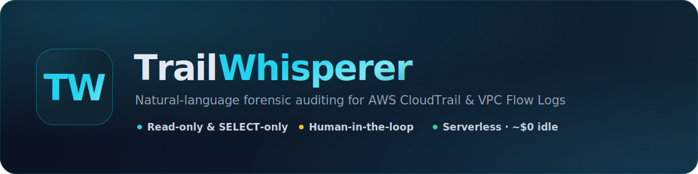
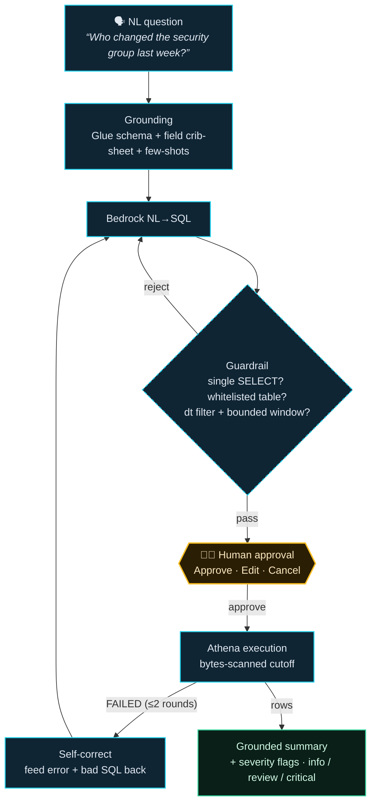
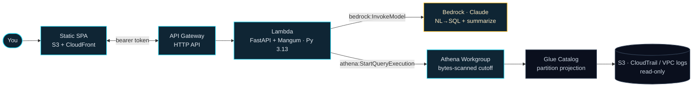

<p align="center">
  
</p>

<p align="center">
  <a href="deploy/README.md"></a>
  
  
  
  
</p>

Ask *"Who changed the security group last week?"* or *"Show me rejected SSH connections to internal hosts yesterday."* TrailWhisperer translates the question into Athena SQL with Amazon Bedrock (Claude), shows you the query for approval, runs it, and summarizes the returned rows into a plain-language narrative with security flags.

It is **serverless, ephemeral, and low-cost**: there is no always-on compute. Deploy it when you need to investigate, tear it down when you're done. Idle cost is effectively zero.

---

## What it does (step by step)



1. **You ask a question in natural language** in the web console (optionally scoping it with a time range or model choice).
2. **Grounded NL → SQL.** The backend sends your question to Amazon Bedrock along with the Glue table schema, a CloudTrail/VPC field crib-sheet, and few-shot examples. Bedrock returns Athena (Trino-dialect) SQL.
3. **Guardrail validation.** The generated SQL is parsed (not string-matched) and rejected unless it is a single **`SELECT`** against a whitelisted table, with a **mandatory `dt` partition filter** and a bounded time window. This keeps the query read-only *and* keeps Athena bytes-scanned (cost) low.
4. **Human-in-the-loop approval.** The SQL is **never executed automatically.** It is displayed in an approval "warrant" modal — with a plain-language explanation of what it does and an estimated scan scope — for you to **Approve / Edit / Cancel**. (An opt-in auto-run mode still shows the SQL and offers a cancellable countdown before running.)
5. **Athena execution.** On approval, the query runs against your CloudTrail / VPC Flow Log data via an Athena Workgroup that enforces a per-query bytes-scanned cutoff.
6. **Grounded summarization.** Bedrock summarizes **only the rows Athena actually returned** — it does not invent data — into a narrative plus heuristic severity flags (info / review / critical). Results are also shown as a paginated table with a per-query bytes-scanned and estimated-cost indicator.
7. **In-session case log.** Every investigation this session is logged in the sidebar so you can jump back to or re-run earlier questions.

If an Athena query fails, the error and the bad SQL are fed back to the model to self-correct (a couple of rounds), then you're offered a manual edit.

## What it's useful for

- **Incident response & forensic auditing** without learning Athena SQL or the CloudTrail JSON schema.
- **Security investigations** across two log sources — CloudTrail (*who did what*) and VPC Flow Logs (*network traffic*) — including **cross-log correlation** (e.g. "did this IP make API calls *and* network connections?") via `UNION ALL`.
- **Inspecting complex nested JSON** such as security-group `ipPermissions` to catch things like SSH/RDP opened to `0.0.0.0/0`.
- **Correlating static security posture with live activity** — an optional [Prowler scan](#optional-prowler-security-scan) exposes findings (open security groups, failing checks) as a third queryable table, so you can ask *"list my critical Prowler findings"* or line an open-SG finding up against actual VPC traffic on the same port.
- **Ad-hoc, on-demand auditing** where standing up a full SIEM is overkill — spin it up, investigate, tear it down.

## Architecture



- **Frontend:** Vanilla JS / HTML / CSS SPA — no build step, hosted on S3 behind CloudFront.
- **Backend:** One Python Lambda running FastAPI via the Mangum adapter. Three endpoints: `POST /api/generate-sql`, `POST /api/execute-sql`, `GET /api/results/{execution_id}`.
- **Data catalog:** Glue tables use **partition projection** (`account` / `region` / `dt`) — no Glue Crawler, no always-on cost.
- **Auth:** A single API key auto-generated into AWS Secrets Manager at deploy time; the SPA sends it as a bearer token.

### Design constraints (non-negotiable)

- **Read-only, `SELECT`-only** — enforced by SQL parsing, against a table whitelist.
- **Human-in-the-loop** — generated SQL is always shown and requires explicit approval; never auto-executed silently.
- **Mandatory partition/time filter** — every query against a **log table** must prune on `dt` and bound its time window (capped by `AllowedTimeRangeMaxDays`). The optional Prowler findings table is exempt (it's a static snapshot, not time-partitioned).
- **Grounding over hallucination** — summaries derive strictly from returned rows.
- **Least-privilege IAM** — Bedrock scoped to the chosen model, Athena to the workgroup, Glue to the DB/tables, S3 read-only on the log buckets.

---

## Cost

TrailWhisperer is built to cost **almost nothing when idle** and only a few cents per investigation when used. There is no always-on compute (no NAT gateway, EC2, Redshift, Glue Crawler, or OpenSearch), so a deployed-but-unused stack drifts toward zero.

> ⚠️ **These are rough, order-of-magnitude estimates** (us-east-1, early 2026) to set expectations — **not** a billing guarantee. Actual charges depend on your region, the Bedrock model you pick, how much data Athena scans, and how often you query. Always confirm against the [AWS pricing pages](https://aws.amazon.com/pricing/) and your own Cost Explorer.

### Idle cost (deployed, no queries)

| Resource | Idle charge |
|---|---|
| Lambda, API Gateway, Athena, Bedrock | **$0** — pay-per-use, nothing runs when idle |
| DynamoDB (`PAY_PER_REQUEST` sessions table) | **$0** idle; rows auto-expire via TTL |
| Glue Data Catalog (partition projection, no crawler) | **$0** (free under 1M objects) |
| Secrets Manager (auth token) | **~$0.40 / month** per secret |
| S3 (SPA + Athena results w/ 7-day lifecycle) | **pennies / month** (tiny objects, results expire) |
| CloudFront | **~$0** idle (pay per request/GB served) |

**Idle total: well under ~$1/month**, dominated by the one Secrets Manager secret.

### Per-investigation cost

Each question makes up to 3 Bedrock calls (generate SQL → plain-language explanation → summarize) plus one Athena query:

- **Athena** — **$5 per TB scanned**, and the workgroup enforces a `BytesScannedCutoff` (default **1 GB → ≤ $0.005/query** hard cap). The mandatory `dt` partition pruning keeps typical queries far below that, so most investigations cost a **fraction of a cent** in Athena.
- **Bedrock** — priced per token; the grounded system prompt (~8K tokens) is re-sent on each generation (no prompt caching yet). Rough cost per investigation by model:

  | Bedrock model | Approx. $/1M in / out | ~Per investigation |
  |---|---|---|
  | Claude 3.5 Sonnet v2 *(default)* | ~$3 / ~$15 | **~$0.03–0.08** |
  | Claude 3.5 Haiku / Nova Lite | ~$0.80–1 / ~$4–5 | **~$0.01–0.02** |
  | Amazon Nova Micro | ~$0.035 / ~$0.14 | **sub-cent** |

  Switch models in the composer's model picker to trade cost for quality. (Bedrock token prices are set by AWS and vary by model/region — check the [Bedrock pricing page](https://aws.amazon.com/bedrock/pricing/).)

**Rule of thumb:** a day of active investigating on the default model is typically **cents to low single-digit dollars**.

### Optional Prowler scan cost

If you enable `EnableProwlerScan` (see below), a scan runs on **CodeBuild** (`BUILD_GENERAL1_SMALL`, ~$0.005/build-minute). A full 15–45 min account scan is **~$0.08–0.25 per run**, plus negligible S3 storage for the JSON findings. It only runs when you trigger it, so it adds nothing to idle cost.

---

## Deploying

TrailWhisperer offers **two deployment paths** — a zero-idle-cost **serverless**
stack (CloudFormation, one-click) and an always-on **EC2** option (AWS CDK) that
runs the same Docker containers as local dev on a VM. Both provision the identical
Athena / Glue / S3 / IAM data plane.

👉 **Full deployment guide — parameters, one-click launch, publishing releases, and teardown — lives in [`deploy/README.md`](deploy/README.md).**

- **Serverless (recommended, ~$0 idle):** [`deploy/serverless/`](deploy/serverless/) — CloudFormation template + build/publish scripts.
- **EC2 (always-on VM):** [`deploy/ec2/`](deploy/ec2/) — CDK app that stands up the data plane plus a `docker compose` instance.

## Optional Prowler security scan

Setting `EnableProwlerScan=true` provisions an optional [Prowler](https://github.com/prowler-cloud/prowler) scan so you can query your static security posture alongside the logs. It adds (only when enabled):

- a **CodeBuild project** that runs `prowler aws -M json-asff -B <bucket>` (its role uses the AWS-managed `SecurityAudit` + `ViewOnlyAccess` policies — read-only, account-wide),
- a **findings S3 bucket** for the JSON output, and
- a **Glue table** (default `prowler_findings`) exposing the findings to Athena.

The orchestrator's prompt and guardrail learn the new table automatically (via the `GLUE_PROWLER_TABLE` env var): it is whitelisted for `SELECT`, but — because Prowler findings are a **point-in-time snapshot, not time-series** — it is **exempt from the mandatory `dt` partition filter** the log tables require.

**Running a scan.** The stack **auto-runs the scan on deploy** — a bundled trigger (custom resource) starts the CodeBuild project as soon as `EnableProwlerScan=true` is applied, so you don't have to kick it off by hand. The build runs Prowler, flattens the nested ASFF output into Athena-ready JSONL (via `jq`), and writes it to the findings bucket's `athena/` prefix that the Glue table reads. A full account scan takes **~15–45 min** after the build starts.

To **re-scan** later (Prowler is a point-in-time snapshot), either re-deploy the stack (any update re-fires the trigger) or start a build manually:

```bash
aws codebuild start-build --project-name <ProwlerScanProjectName-from-outputs>
```

Once the build finishes, ask things like *"List my critical Prowler findings"* or *"Which high-severity Prowler checks are failing?"* (sample chips for these are in the console's query library). If a scan hasn't completed yet, these queries return no rows.

> **Correlation caveat — honest scope.** You can also ask *"did the open security groups flagged by Prowler receive any internet traffic?"*, which `UNION ALL`s the finding with VPC Flow Logs. This is a **heuristic, side-by-side correlation by port / internet-facing traffic — not a precise per-security-group join.** VPC Flow Logs record ENIs and IPs and carry **no security-group id**, so there is no key to tie a *specific* `sg-…` to specific flows. Treat it as a triage aid, not proof.

> **Field-mapping note.** The CodeBuild `jq` step maps Prowler's ASFF fields to the Glue table's flat columns (`GeneratorId`→`check_id`, `Compliance.Status`→`PASS`/`FAIL`, `Severity.Label`→lowercase `severity`, `Resources[0]`→`resource_id`/`region`, etc.). These mappings are based on Prowler's current ASFF schema; if a Prowler version emits different field names, adjust the `jq` filter in the `ProwlerScanProject` buildspec. Check the CodeBuild build log — it prints `Findings rows: N` — to confirm the transform produced rows.

---

## Local development

A `docker-compose.yml` runs the FastAPI backend (Uvicorn auto-reload) and a static file server for the frontend.

### 1. Configure environment

```bash
cp .env.example .env
```

The defaults work out of the box. The backend calls Bedrock/Athena through `boto3`, which resolves AWS credentials from the standard provider chain:

- **Host `~/.aws` profile:** leave the AWS vars in `.env` commented out.
- **No mounted profile (plain VM):** set `AWS_ACCESS_KEY_ID`, `AWS_SECRET_ACCESS_KEY`, and (for temporary/STS/SSO creds) `AWS_SESSION_TOKEN` in `.env`.

See `AUTHENTICATION.md` for details. Keep `.env` out of version control.

> **Athena locally:** running against real Athena requires `ATHENA_OUTPUT_LOCATION` to be set when using the default `primary` workgroup (which has no results location). Match `AWS_REGION` to where your Glue tables live.
>
> After editing `.env`, recreate the container (env changes need a rebuild, not just a restart): `docker compose up -d --force-recreate`.

### 2. Run

```bash
docker compose up --build
```

- **Backend health:** http://localhost:8000/api/health
- **Frontend:** http://localhost:8080

The default local auth token is `local-dev-token` (from `docker-compose.yml`); use it in the login modal.

---

## Repository layout

```
backend/                  FastAPI app (main.py), Dockerfile, requirements, mock_server.py
  requirements-lambda.txt   Lambda-only deps (no uvicorn; boto3 from runtime)
frontend/                 Vanilla JS SPA (index.html, style.css, app.js, config.js) — no build step
deploy/                   Deployment options (see deploy/README.md)
  README.md                 Full deployment guide (serverless + EC2)
  serverless/               CloudFormation one-click stack
    investigator-stack.yaml   The whole system as one template
    scripts/build-backend.sh  Package backend/ into dist/backend.zip (manylinux wheels)
    scripts/publish.sh        Publish a release to regional artifact buckets + Launch Stack URL
  ec2/                      AWS CDK (Python) app: data plane + docker-compose EC2 instance
docker-compose.yml        Local dev: backend (Uvicorn) + static frontend
AGENT_CONTEXT.md          Canonical architecture summary
AUTHENTICATION.md         Backend AWS credential resolution (Lambda vs. local)
SECURITY_FINDINGS.md      Security review notes
roadmap.md                Development tracker
```
